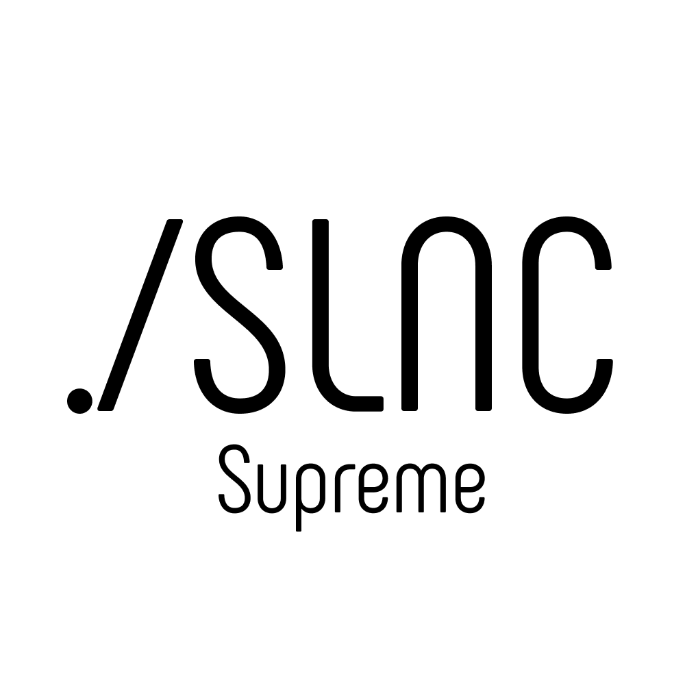
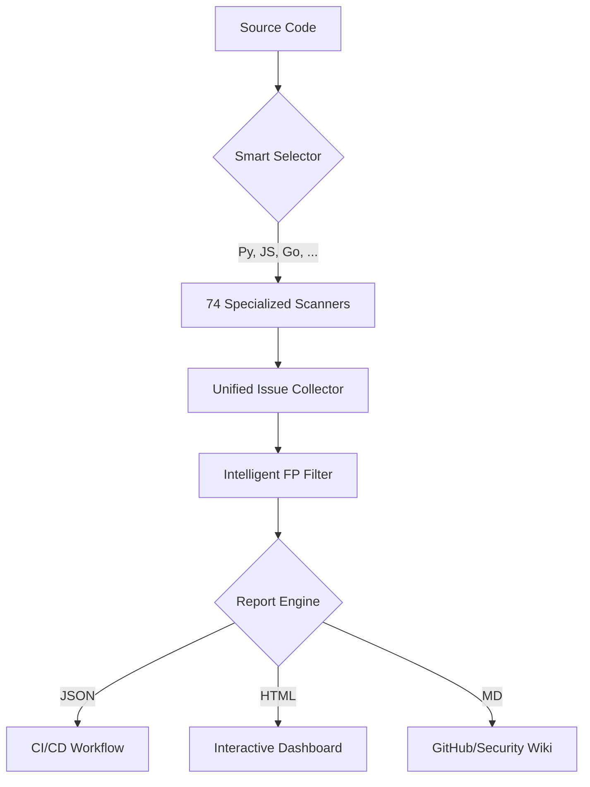

<p align="center">
  
</p>

# <p align="center">Supreme 2 Light</p>
### <p align="center">The AI-First Multi-Language Security Scanner</p>

<p align="center">
  <a href="https://pypi.org/project/supreme2l/"></a>
  <a href="https://www.python.org/downloads/"></a>
  <br>
  
  
  
  <a href="LICENSE"></a>
</p>

---

**Supreme 2 Light** is a next-generation Static Application Security Testing (SAST) tool designed for the AI era. With **74 specialized scanners** and **180+ AI agent security rules**, it provides the most comprehensive local security analysis available.

> [!IMPORTANT]
> **AI-Native Security**: Includes specialized rules for MCP, RAG, prompt injection, and tool poisoning.

---

## ✨ Key Features

| Feature | Description |
| :--- | :--- |
| 🔍 **74 Scanners** | Comprehensive coverage for 42+ languages and 100+ file extensions. |
| 🤖 **AI-Agent Ready** | 180+ security rules specifically designed for the agentic era. |
| 🎯 **Intelligent FP Filter** | Reduces noise by 40-60% using context-aware analysis. |
| ⚡ **Parallel Engine** | Multi-core processing provides up to 40x faster scanning. |
| 🏖️ **Sandbox Safe** | Works automatically in restricted environments like OpenAI Codex. |
| 📦 **Zero-Config** | "Smart Install" automatically detects and sets up all required tools. |

---

## 🏗️ How It Works



---

## 🚀 Quick Start

### 1. Installation

We recommend using a virtual environment to keep your system clean.

```bash
# Create and activate environment
python -m venv venv
# Windows: venv\Scripts\activate | macOS/Linux: source venv/bin/activate

# Install Supreme 2 Light
pip install supreme2l
```

### 2. Five-Minute Setup

```bash
# Initialize project
s2l init

# Install all missing security tools (Auto-detected)
s2l install --all

# Run your first scan
s2l scan .
```

---

## 📊 Beautiful Reports

Supreme 2 Light generates high-fidelity reports with a stunning glassmorphism UI:

- **JSON**: Machine-readable for CI/CD pipelines.
- **HTML**: Interactive charts and detailed issue breakdowns.
- **Markdown**: Perfect for PR comments and documentation.
- **SARIF**: Standardized format for security tool interoperability.

---

## 🌐 Language Support

Supreme 2 Light covers the entire development stack with **42 scanner types**:

<details>
<summary><b>Backend & Systems (Python, JS/TS, Go, Rust, Java, C++, etc.)</b></summary>

| Language | Scanner | Extensions |
| :--- | :--- | :--- |
| Python | Bandit | `.py` |
| JS/TS | ESLint | `.js`, `.jsx`, `.ts`, `.tsx` |
| Go | golangci-lint | `.go` |
| Rust | Clippy | `.rs` |
| Java | Checkstyle | `.java` |
| C/C++ | cppcheck | `.c`, `.cpp`, `.h` |

</details>

<details>
<summary><b>Infrastructure & DevOps (Docker, Terraform, K8s, Ansible)</b></summary>

| Tool | Scanner | Description |
| :--- | :--- | :--- |
| Docker | Hadolint | Dockerfile best practices |
| Terraform | TFLint | Cloud infra security |
| Kubernetes | Kubeval | Manifest validation |
| Ansible | Ansible-lint | Playbook security |

</details>

<details>
<summary><b>Web & Config (HTML/CSS, YAML, JSON, TOML, SQL)</b></summary>

| Type | Scanner | Extensions |
| :--- | :--- | :--- |
| Styles | Stylelint | `.css`, `.scss`, `.less` |
| YAML | Yamllint | `.yml`, `.yaml` |
| Config | Taplo | `.toml` |
| Database | SQLFluff | `.sql` |

</details>

---

## 🎯 False Positive Protection

Tired of security noise? Our **Intelligent FP Filter** uses context-aware heuristics to differentiate between real threats and safe patterns.

- **Security Wrappers**: Detects if credentials are protected by classes like `SecureString`.
- **Test Context**: Automatically lowers priority for findings in `test/` or `mock/` folders.
- **Cache Hashes**: Recognizes MD5/SHA1 usage for caching vs. cryptographic purposes.

---

## 📜 License & Credits

Supreme 2 Light is licensed under **AGPL-3.0**. Built with ❤️ by **Silence AI**.

- **Built With**: Python 3.10+, Click, Rich.

📖 **[Full Documentation & Everything Else → silence.codes/supreme](https://silence.codes/en/supreme/)**